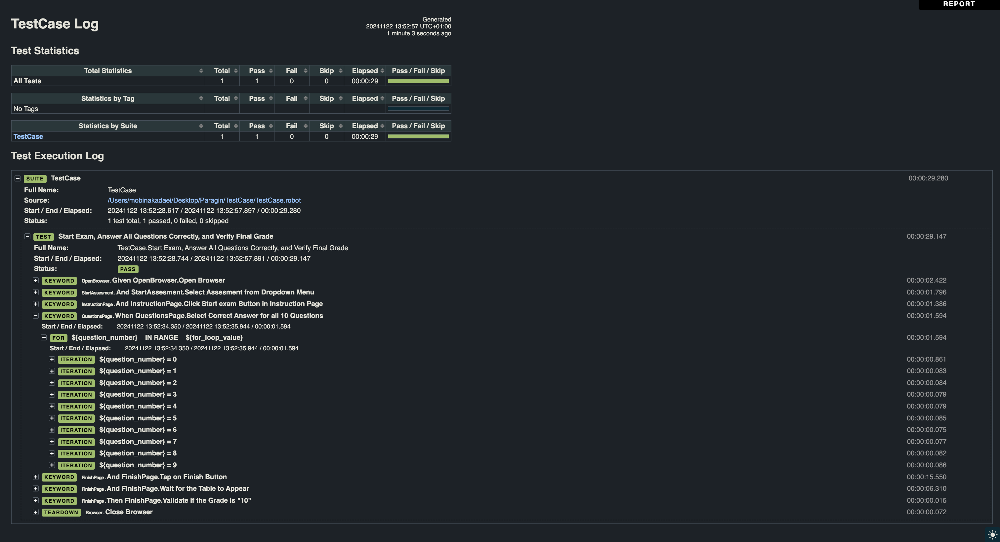

## UI Test Automation with Robot Framework & Playwright

Before running the tests, ensure that you have the following installed:

## Python (version 3.x):

   **For Mac:**
   ```sh
   brew install python
   ```

   **For Windows:**
   ```sh
   winget install --id Python.Python.3
   ```

## pip (Python package manager):

   **Open a terminal and run:**
   ```sh
   curl -O https://bootstrap.pypa.io/get-pip.py
   ```

   **For Windows Run:**
   ```sh
   python get-pip.py
   ```

   **For Mac run:**
   ```sh
   python3 get-pip.py
   ```

- Robot Framework
- Playwright libraries for browser automation (Which is Browser Library in Robot Framework)

You can install the required libraries by running the following commands:


**Installation Guide**

Follow these steps to set up the project on your machine:

## 1. Clone the Repository:

    git clone https://github.com/kadaeimobina/TestAutomation.git
    cd TestAutomation/TestCase

## 2. Install Dependencies:
    pip3 install robotframework
    pip3 install robotframework-browser
    rfbrowser init 

## 3. Running the Tests (For UI Testing):

   ```sh
   robot TestCase.robot
   ```

## Test Approach

The UI test cases for this project are located in the TestCase/TestCase.robot folder and will be executed according to the installation steps outlined earlier. I have implemented the Page Object Model (POM) design pattern in combination with Playwright for interacting with web elements in Robot Framework. This approach involves creating dedicated keyword files for each web page, encapsulating the logic for element interactions separately. By structuring the tests in this way, the code is not only more maintainable but also reusable and scalable, as it clearly separates the page-specific actions from the actual test cases. This organization enhances the overall test suite by improving clarity, reducing duplication, and simplifying future updates or expansions.

Keywords for interacting with each web page's elements are organized within separate files in the pageObjectModel directory. This modular structure ensures that main keywords and variables are defined and detailed within dedicated files, while the test case files focus solely on test case definitions, without embedding logic or variables. Additionally, if any variables need to be changed, they can be modified in a single, dedicated file for each page object, simplifying updates and maintenance. This separation leads to cleaner, easier-to-read, and more manageable test scripts.

I also adopted the Gherkin syntax for writing test cases, as it serves as a common language between QA, developers, and product teams. This approach ensures that all team members, regardless of their role, can easily understand the test cases, fostering better collaboration and communication throughout the development process.


Here's an overview of how I implemented this approach:

## 1. Page Object Model (POM) Structure
   
   Each web page in the application under test is represented by a set of keywords in a dedicated Robot Framework test file, encapsulating all relevant actions, variables, and web elements for that page. This approach enhances modularity and maintainability by centralizing code for each page in a single file, reducing duplication and simplifying updates. By separating test logic (test cases) from page interaction logic (UI elements and actions), this method ensures that UI changes only require updates to the relevant page object, leaving the test cases unaffected. It also improves test script readability, as the focus remains on the behavior being tested, and supports easier adaptation to UI changes. Additionally, keeping page-specific variables within the same file boosts reusability, making it simple to use the file with different variables for other test cases.


## 2. Modularized Variables

  I have centralized all variables in the keyword files instead of including them in the test case files, promoting cleaner code and better separation of concerns. This structure makes it easier to test different scenarios with varying inputs and simplifies updates when web elements change, as modifications are confined to the relevant page object.


## 3. Testing with Robot Framework, Playwright and Python:
  For this project, I chose Python and Robot Framework due to their strengths in test automation and suitability for the project's needs. Here are the reasons behind this decision:
   
   **Why Did I Used Robot Framework:**

   * Keyword-Driven Testing: 
   Robot Framework supports a keyword-driven approach, which is highly readable and allows even non-technical stakeholders to understand test cases. This makes collaboration and test maintenance easier

   * Built-in Reporting: 
   Robot Framework generates detailed, built-in reports and logs, which helps in quick debugging and test result analysis.(I have included my test report at the beginning of this file to showcase its detailed and comprehensive nature. The report is designed to be easily understood by all team members, whether they have technical or non-technical backgrounds.)


   For the UI testing I used Browser Library in Robot Framework. The Browser library in Robot Framework integrates Playwright, a browser automation tool, to provide a high-level, keyword-driven interface for automating web browsers.
   
   **Why Did I Used Playwright for UI testing:**

   * Fast and Reliable Automation: 
   Playwright is designed for high-speed and stable browser automation. It handles asynchronous events, network conditions, and dynamic content well, providing reliability even with complex web applications.

   * Integration with Robot Framework: 
   Playwright integrates well with Robot Framework, which allows for a keyword-driven testing approach. By combining Playwright's powerful browser automation capabilities with Robot Framework's modular, readable syntax, I can create easy-to-maintain, reusable test cases for UI testing.
  
   * Auto-Waiting for Elements: 
   Playwright includes automatic waiting for elements to be ready before performing interactions, reducing the need for explicit waits or time delays, which improves test stability and execution speed.


   **Why Did I Used Python:**

   * Extensibility: 
   Python provides a wide range of testing libraries, including powerful tools for data handling, reporting, and integration with CI/CD pipelines, making it scalable for both small and large projects.
   
   * Scalability:
   Python's flexible design allows test frameworks and scripts to scale with the needs of a project. Whether it’s a small, one-off script or a comprehensive end-to-end testing framework with hundreds of test cases, Python can easily handle the complexity.


